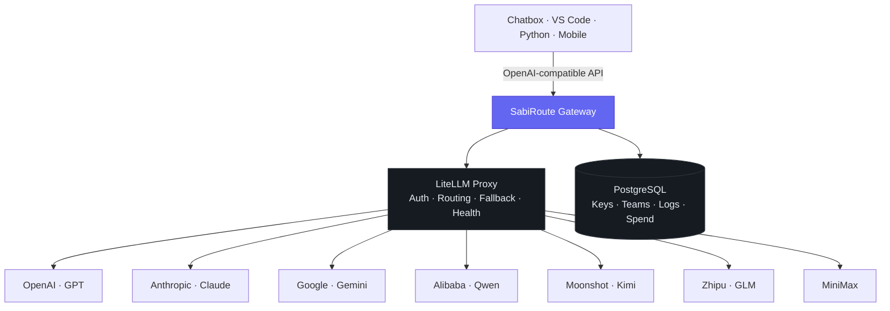
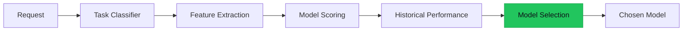

<div align="center">


<br/>

[](https://git.io/typing-svg)

[](https://github.com/yourfavCHEFP/SabiRoute/releases)
[](https://www.python.org/)
[](https://github.com/BerriAI/litellm)
[](./LICENSE)
[]()


**[Architecture](#️-architecture)** | **[Model Universe](#-the-sabiroute-model-universe)** | **[Demo](#-demo)** | **[Quick Start](#-quick-start)** | **[Roadmap](#️-roadmap)** | **[Contributing](#-contributing)** | **[License](#-license)** | **[Author](#-author)**

</div>

---

Personal infrastructure, not another provider wrapper. **SabiRoute** is a self-hosted, OpenAI-compatible LLM gateway that sits between every app on my stack — Chatbox, VS Code, Python scripts, mobile — and every model provider worth talking to. One endpoint in. Health-aware routing, automatic fallback, budgets, and observability out. No app ever needs to know or care which provider actually answered.

Built on top of **LiteLLM** as the proxy engine, with a routing, intelligence, and observability layer written on top of it — because the interesting engineering problem was never "how do I call an LLM API," it's **"how do I decide, automatically and cheaply, which model should answer this specific request."**

> *"Sabi"* — Nigerian pidgin for "to know, to be skilled at." A gateway that knows which model to route to, so you don't have to.

## 🎯 Key Features

- 🧠 **Intelligent Routing** — requests are classified by task type (coding, reasoning, research, simple) and routed to the model best suited for it, not just the first one in a list.
- 🛡️ **Health-Aware Fallback** — a provider timing out or throwing `429`/`5xx` is a routing event, not an outage. SabiRoute fails over automatically and puts the provider on cooldown.
- 🧩 **Virtual Model Stacks** — clients call `SabiRoute_Coding` or `SabiRoute_Research`, never a raw provider/model string. Swap the underlying provider without touching a single client.
- 💰 **Budgets & Virtual Keys** — every client (Chatbox, VS Code, phone, a specific project) gets its own key, its own spend cap, and its own allowed-model list.
- 📊 **Full Observability** — every request logged to Postgres: latency, tokens, cost, provider, success/failure — so "which model is actually doing my work?" has a real answer.
- 📈 **Empirical Benchmarking** — before the router trusts a model, it's benchmarked on latency, cost, and task accuracy against the others. Routing decisions are backed by data collected on my own workloads, not vendor marketing.
- 🔌 **One Endpoint, Any Client** — fully OpenAI API–compatible, reachable locally or remotely over Tailscale from any device.
- 🤖 **ML-Based Router (in progress)** — the long-term goal: replace deterministic scoring with a model trained on real routing history to predict the best model per request.

## 🎬 Demo

> `docs/demo.gif` is generated locally, not pre-rendered here, so the recording always matches whatever's actually running — no staged footage.

<p align="center">
  
  <br/>
  <sub>Not showing yet? Run the recipe below once v0.1 is up — it'll drop right into that spot.</sub>
</p>

Record it yourself with [VHS](https://github.com/charmbracelet/vhs) once the gateway is running:

```bash
brew install vhs
vhs docs/demo.tape   # -> writes docs/demo.gif
```

`docs/demo.tape` is checked into the repo — it types a real request, kills the primary provider mid-demo, and replays the same request to show the fallback happening live.

## 🏗️ Architecture



**The routing engine**, once past the deterministic priority/fallback stage, becomes its own decision layer:



This is the part that turns SabiRoute from *"I configured LiteLLM"* into an actual ML systems project.

## 🌐 The SabiRoute Model Universe

| Provider | Models | Role |
|---|---|---|
| OpenAI | GPT family, reasoning models | High-quality general fallback |
| Anthropic | Claude Sonnet / Opus / Haiku | Coding, long-context, research |
| Google | Gemini Pro / Flash | Multimodal, fast responses |
| Alibaba | Qwen, Qwen Coder | Coding, reasoning — verified working |
| Moonshot | Kimi, Kimi Coding | Long-context, coding — verified working |
| Zhipu | GLM | Reasoning, coding — verified working |
| MiniMax | MiniMax | Cost/latency balancing — verified working |
| *Planned* | DeepSeek, Mistral, Groq, xAI, OpenRouter, local Ollama, Hugging Face | Expansion tier |

Clients never see this table directly — they see **virtual stacks**:

`SabiRoute_Ultimate` · `SabiRoute_Coding` · `SabiRoute_Research` · `SabiRoute_Reasoning` · `SabiRoute_Fast` · `SabiRoute_Cheap`

## 🧰 Tech Stack

| Layer | Technology |
|---|---|
| Gateway engine | [LiteLLM](https://github.com/BerriAI/litellm) Proxy |
| Language | Python (managed with `uv`) |
| Database | PostgreSQL |
| Containerization | Docker + Docker Compose |
| Config | YAML (per-provider, per-route, per-policy) |
| Remote access | Tailscale |
| CI/CD | GitHub Actions |
| Monitoring (later) | Prometheus + Grafana |
| API format | OpenAI-compatible |

## 🚀 Quick Start

> Current milestone: **v0.1 — Weekend MVP**. Multi-provider priority routing with automatic fallback, no intelligence layer yet.

```bash
# clone the repo
git clone https://github.com/yourfavCHEFP/SabiRoute.git
cd SabiRoute

# install dependencies
uv sync

# copy and fill in your provider credentials
cp .env.example .env

# bring up LiteLLM + Postgres
docker compose up -d

# point any OpenAI-compatible client at:
# http://localhost:4000/v1
```

Ask for a virtual stack instead of a raw model:

```bash
curl http://localhost:4000/v1/chat/completions \
  -H "Authorization: Bearer $SABIROUTE_API_KEY" \
  -H "Content-Type: application/json" \
  -d '{
    "model": "SabiRoute_Coding",
    "messages": [{"role": "user", "content": "Explain this stack trace"}]
  }'
```

If it fails over from Qwen → GLM → Kimi → Claude without you noticing, v0.1 did its job.

## 🗺️ Roadmap

| Stage | Scope |
|---|---|
| **v0.1 — Weekend MVP** | Repo skeleton, LiteLLM gateway, multi-provider config, model registry, virtual stacks, priority fallback |
| **v0.2 — Reliability** | Health monitoring, PostgreSQL logging, virtual API keys, budgets & rate limits |
| **v0.3 — Observability** | Full request logging, spend tracking, empirical benchmarking suite, admin dashboard |
| **v0.4 — Remote** | Tailscale access, security hardening, CI/CD |
| **v1.0 — Intelligence** | Task-classification router, model scoring, then an ML model trained on real routing history to pick the best model per request |

Existing routing setup (**OmniRoute**, `:20128`) stays running throughout development — SabiRoute is built alongside it, not as a risky in-place replacement.

## 🤝 Contributing

This is currently a solo build tied to my own AI infrastructure and ML learning path, so it isn't accepting external contributions yet — but issues, ideas, and "you should route this differently" arguments are always welcome. Once the intelligence layer (v1.0) lands, this section gets a real contribution guide.

## 📄 License

Released under the [Apache-2.0 License](./LICENSE) — use it, fork it, route through it.

## 👤 Author

**Olumide "CHEF_P" Oladosu** — ML/AI engineering, building toward tier-1 ML/MLOps roles.
GitHub: [@yourfavCHEFP](https://github.com/yourfavCHEFP)

---

<div align="center">
<sub>Built because every other gateway assumed I'd only ever want to talk to one provider at a time.</sub>
</div>
