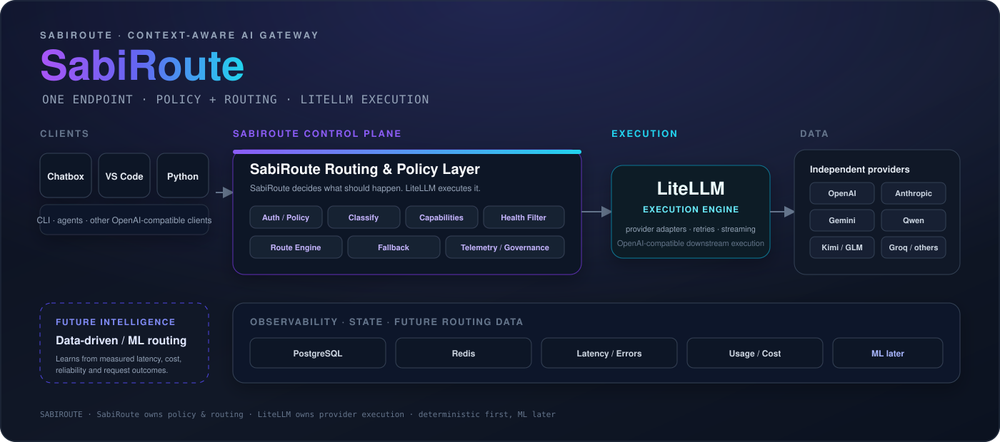

<div align="center">



<br/>


[](https://git.io/typing-svg)

[](https://github.com/yourfavCHEFP/SabiRoute/releases)
[](https://www.python.org/)
[](https://github.com/BerriAI/litellm)
[](./LICENSE)
[]()

**One gateway. Multiple providers. Health-aware routing.**

[Architecture](#-architecture) |
[Routing](#-routing-intelligence) |
[Providers](#-provider-strategy) |
[Quick Start](#-quick-start) |
[Roadmap](#-engineering-roadmap) |
[Contributing](#-contributing) |
[License](#-license)

</div>

---

# SabiRoute

### The Context-Aware, Health-Aware AI Gateway for Developers

SabiRoute is an open-source, self-hosted AI gateway designed to give developers **one OpenAI-compatible endpoint across multiple model providers**.

It sits between applications such as:

- Chatbox
- VS Code and other IDEs
- Python applications
- CLI tools
- ML projects
- Future coding agents

and the underlying model providers.

Instead of forcing every client to know which provider or model to use, SabiRoute is designed to make that decision centrally through:

- routing policies
- request classification
- model/provider capabilities
- health signals
- deterministic fallback
- latency
- cost
- reliability
- telemetry
- and eventually machine learning

> **SabiRoute is not another LiteLLM wrapper.**
>
> LiteLLM is the current execution engine.
>
> **SabiRoute is the control, routing, intelligence and developer-experience layer built around it.**

> **"Sabi"** — Nigerian Pidgin for "to know" or "to be skilled at."
>
> A gateway that knows which model should handle a request, so the developer does not have to.

---

# 🎯 Why SabiRoute?

Modern AI applications increasingly depend on multiple model providers.

One model may be:

- faster,
- another cheaper,
- another better at reasoning,
- another better at coding,
- another better at long context,
- while another may simply be unavailable.

The problem is not only:

> "How do I call an LLM?"

The more interesting systems problem is:

> **"How do I decide which available model should handle this particular request, while remaining reliable when providers fail?"**

SabiRoute is being built around that problem.

The long-term goal is a system where applications interact with one stable endpoint while SabiRoute handles the complexity underneath.

---

# ✨ Core Capabilities

The project is being developed around the following capabilities.

### 🧠 Context-Aware Routing

Classify incoming workloads and eventually route them according to task requirements rather than simply selecting the first model in a list.

Initial workload classes:

```text
INLINE_COMPLETION
CHAT
CODING_AGENT

The intended bias is:
Request Type	Primary Objective
INLINE_COMPLETION	Latency-first
CHAT	Quality + context
CODING_AGENT	Reasoning + tool capability


🛡️ Health-Aware Fallback
A provider failure should become a routing event, not a complete application outage.
SabiRoute is designed to:
1. identify unhealthy deployments
2. remove them from the eligible candidate pool
3. apply deterministic fallback
4. allow failed deployments to recover after cooldown
5. keep routing explainable
Retry behavior will eventually distinguish retryable failures such as:
429
5xx
timeouts
connection failures

from failures that should not simply be retried.
🧩 Virtual Model Policies
Clients should not need to know every provider/model combination.
Instead of coupling an application to:
provider/model

the application can eventually request a SabiRoute policy such as:
SabiRoute_Ultimate
SabiRoute_Coding
SabiRoute_Research
SabiRoute_Reasoning
SabiRoute_Fast
SabiRoute_Cheap

The underlying deployments can then change without requiring every client configuration to change.
📊 Observability
SabiRoute is designed to collect routing and execution information such as:
- latency
- success/failure
- provider
- deployment
- token usage
- estimated cost
- error type
- routing decision
- request type
The long-term objective is to make routing decisions measurable and explainable, rather than based on assumptions.
📈 Empirical Benchmarking
Before SabiRoute attempts to make intelligent routing decisions, it needs real evidence.
The project therefore intends to benchmark providers and deployments on dimensions such as:
- latency
- reliability
- cost
- capability
- task performance
- historical success
The future routing intelligence should be based on measured behavior rather than provider marketing claims.
🤖 Future ML Router
Machine learning is a later stage, not the current routing mechanism.
The intended progression is:
Deterministic Routing
        ↓
Capability-Aware Routing
        ↓
Telemetry
        ↓
Benchmarking
        ↓
Model Scoring
        ↓
Historical Routing Data
        ↓
ML Router

The ML router must never be allowed to bypass health and safety constraints.
If the ML component fails, SabiRoute should fall back to deterministic routing.
🏗️ Architecture
Current target architecture
                    CLIENTS
 ┌───────────────────────────────────────────────┐
 │ Chatbox │ VS Code │ Python │ CLI │ ML Apps   │
 └───────────────────────┬───────────────────────┘
                         │
                         ▼
              ┌──────────────────────┐
              │     SabiRoute API    │
              ├──────────────────────┤
              │ Authentication       │
              │ Policy               │
              │ Request Classification
              │ Capability Filtering │
              │ Health Filtering     │
              │ Routing Engine       │
              │ Fallback             │
              └──────────┬───────────┘
                         │
                         ▼
                 ┌──────────────┐
                 │   LiteLLM    │
                 │    Proxy     │
                 └──────┬───────┘
                        │
          ┌─────────────┼─────────────┐
          ▼             ▼             ▼
       OpenAI       Anthropic       Google
       Qwen         Kimi            GLM
       MiniMax      Groq            etc.
                        │
                        ▼
              ┌──────────────────┐
              │ PostgreSQL/Redis │
              │ telemetry/state  │
              └──────────────────┘

The important architectural boundary is:
SabiRoute
    =
eligibility + policy + routing + health + governance

LiteLLM
    =
provider execution abstraction

SabiRoute decides which deployment should be attempted.
LiteLLM handles executing the provider request.
This separation is intentional.
🔄 Request Flow
The intended mature request path is:
Client
  │
  ▼
SabiRoute API
  │
  ▼
Authentication / Policy
  │
  ▼
Request Classification
  │
  ▼
Capability Filter
  │
  ▼
Health Filter
  │
  ▼
Routing Engine
  │
  ├── deterministic rules
  ├── latency
  ├── reliability
  ├── cost
  └── future ML scoring
  │
  ▼
LiteLLM
  │
  ▼
Provider
  │
  ▼
Response Normalization
  │
  ▼
Client

At the same time:
             ┌───────────────┐
             │ Request       │
             └───────┬───────┘
                     │
                     ▼
              Classification
                     │
                     ▼
             Capability Filter
                     │
                     ▼
               Health Filter
                     │
                     ▼
              Route Selection
                     │
             ┌───────┴────────┐
             ▼                ▼
        Deployment A      Deployment B
             │                │
             └───────┬────────┘
                     ▼
                  LiteLLM

🧠 Routing Intelligence
SabiRoute's routing intelligence is intentionally being built in layers.
Layer 1 — Deterministic Routing
Request
   ↓
Policy
   ↓
Healthy Candidates
   ↓
Priority
   ↓
Fallback

This is where the project currently belongs.
Layer 2 — Capability-Aware Routing
Request
   ↓
Task Classification
   ↓
Required Capabilities
   ↓
Candidate Filtering
   ↓
Policy Selection

For example:
Coding Agent
     ↓
Requires:
- coding
- reasoning
- long context
- tool capability
     ↓
Remove unsuitable deployments
     ↓
Choose from remaining healthy candidates

Layer 3 — Data-Driven Scoring
Once enough telemetry exists:
Request Features
      +
Provider Features
      +
Historical Performance
      +
Cost
      +
Latency
      +
Reliability
      ↓
Model Score
      ↓
Deployment Selection

Layer 4 — ML Routing
Only after sufficient data exists:
Historical Requests
       ↓
Benchmark Dataset
       ↓
Feature Engineering
       ↓
Training
       ↓
Evaluation
       ↓
ML Router
       ↓
Best Candidate

The ML router remains constrained by:
Health
Policy
Capability
Security
Budget

ML does not override those constraints.
🌐 Provider Strategy
SabiRoute is designed to support multiple independent providers.
The current configuration includes deployment definitions for providers such as:
Provider	Current Configuration Role
OpenAI	General/high-quality workloads
Google Gemini	Fast/general workloads
Groq	Fast open-model inference
Together AI	Hosted open-model inference
DeepInfra	Hosted open-model inference
Moonshot/Kimi	Long-context/coding workloads
MiniMax	Cost/latency experimentation
Cloudflare Workers AI	Edge-hosted inference
OpenRouter	Aggregated provider access
Hugging Face	Open-model inference
Cerebras	High-throughput inference
NVIDIA NIM	NVIDIA-hosted inference
Cohere	Assistant/retrieval workloads
Pollinations AI	OpenAI-compatible endpoint


Planned expansion can include:
DeepSeek
Mistral
xAI
Ollama
other providers

Important
A provider appearing in configuration does not automatically mean that it is currently operational.
A deployment becomes operational only after:
Configuration
      ↓
Credentials
      ↓
Provider access
      ↓
Health test
      ↓
Real request
      ↓
Streaming test
      ↓
Fallback test

This distinction is important for keeping the project honest.
🧱 Current Repository Architecture
sabi-route/
│
├── README.md
├── LICENSE
├── CONTRIBUTING.md
├── CHANGELOG.md
├── SECURITY.md
│
├── pyproject.toml
├── uv.lock
├── .gitignore
├── .env.example
│
├── docker-compose.yml
├── Dockerfile
├── Makefile
│
├── config/
│   ├── config.yaml
│   │
│   ├── models/
│   │   ├── openai.yaml
│   │   ├── anthropic.yaml
│   │   ├── google.yaml
│   │   ├── qwen.yaml
│   │   ├── kimi.yaml
│   │   ├── glm.yaml
│   │   └── minimax.yaml
│   │
│   ├── routes/
│   │   ├── ultimate.yaml
│   │   ├── coding.yaml
│   │   ├── research.yaml
│   │   ├── reasoning.yaml
│   │   ├── fast.yaml
│   │   └── cheap.yaml
│   │
│   └── policies/
│       ├── fallback.yaml
│       ├── health.yaml
│       ├── cost.yaml
│       └── limits.yaml
│
├── src/
│   └── sabiroute/
│       ├── __init__.py
│       ├── main.py
│       │
│       ├── config/
│       │   ├── loader.py
│       │   ├── models.py
│       │   └── validation.py
│       │
│       ├── routing/
│       │   ├── router.py
│       │   ├── policies.py
│       │   ├── fallback.py
│       │   └── health.py
│       │
│       ├── providers/
│       │   ├── registry.py
│       │   ├── base.py
│       │   └── healthcheck.py
│       │
│       ├── monitoring/
│       │   ├── metrics.py
│       │   ├── latency.py
│       │   ├── errors.py
│       │   └── usage.py
│       │
│       ├── security/
│       │   ├── auth.py
│       │   ├── keys.py
│       │   └── permissions.py
│       │
│       ├── intelligence/
│       │   ├── classifier.py
│       │   ├── scorer.py
│       │   └── selector.py
│       │
│       ├── api/
│       │   ├── health.py
│       │   ├── models.py
│       │   └── admin.py
│       │
│       └── utils/
│           ├── logging.py
│           └── time.py
│
├── tests/
│   ├── unit/
│   ├── integration/
│   ├── routing/
│   ├── providers/
│   └── api/
│
├── scripts/
│   ├── health_check.py
│   ├── test_models.py
│   ├── benchmark.py
│   └── seed_models.py
│
├── migrations/
│
├── docs/
│   ├── architecture.md
│   ├── providers.md
│   ├── routing.md
│   ├── security.md
│   ├── deployment.md
│   └── troubleshooting.md
│
└── monitoring/
    ├── prometheus/
    └── grafana/

⚙️ Technology Stack
Layer	Technology
Primary language	Python
Environment	uv
Current execution engine	LiteLLM
Configuration	YAML + Pydantic
API direction	OpenAI-compatible
Database	PostgreSQL
Fast state/cache	Redis
Testing	Pytest
Containerization	Docker / Docker Compose
Remote development	Tailscale
Future monitoring	Prometheus + Grafana
Future ML	Python ML ecosystem
Long-term core option	Go / single binary


The Go architecture is a future direction, not the current implementation.
🚀 Current Development Status
SabiRoute is in active development.
The current implementation has already established important foundations:
- typed configuration models
- configuration validation
- provider registry
- routing policy registry
- health registry foundations
- fallback engine foundations
- route decision objects
- LiteLLM client integration
- monitoring/telemetry foundations
- provider metadata
- local PostgreSQL connectivity
- local Redis connectivity
However, source files existing in the repository do not automatically mean that the corresponding feature is production-complete.
The project uses an evidence-based definition of completion:
Code exists
    ≠
Feature works

A phase is considered complete only after:
Implementation
    +
Integration
    +
Tests
    +
Real execution
    +
Failure validation

🧪 Current Architecture Gate
Before moving into intelligent routing, SabiRoute must first prove that the underlying gateway works reliably.
The current immediate gate is:
1. LiteLLM starts normally
          ↓
2. PostgreSQL integration works
          ↓
3. Redis integration works
          ↓
4. Authenticated health works
          ↓
5. Real completion works
          ↓
6. Streaming works
          ↓
7. Deterministic fallback works
          ↓
8. THEN intelligent routing

This is deliberate.
There is no point training or implementing an intelligent router on top of an execution layer that has not yet been proven reliable.
🛣️ Engineering Roadmap
SabiRoute follows a staged engineering roadmap.
Phase	Focus	Status
00	Architecture & Environment	🟢 Foundation
01	Basic LiteLLM Gateway	🟡 Current gate
02	Provider Expansion	🟡 In progress
03	Model Registry	🟢 Foundation
04	Virtual Models	🟡 Foundation
05	Fallback Engine	🟡 Foundation
06	Health Monitoring	🟡 Foundation
07	Observability	🟡 Foundation
08	PostgreSQL	🟡 Infrastructure active
09	Authentication & API Keys	⚪ Next intelligence boundary
10	Budgets & Rate Limits	⚪ Planned
11	Routing Intelligence	⚪ Planned
12	Model Scoring	⚪ Planned
13	ML Router	⚪ Future
14	Benchmarking	⚪ Future
15	Admin Dashboard	⚪ Future
16	Remote Access / Tailscale	⚪ Future
17	Security Hardening	⚪ Future
18	Testing & Regression	⚪ Future
19	CI/CD	⚪ Future
20	Production Architecture	⚪ Future


🔬 What Makes This an ML Systems Project?
SabiRoute is intentionally being built so that the machine-learning component has a real systems problem to solve.
The eventual dataset can contain observations such as:
request_type
prompt_length
context_length
estimated_complexity
required_capabilities

provider
model
latency
time_to_first_token
tokens
cost

success
failure_type
retry_count

user/task outcome
historical performance

That can eventually become:
                ROUTING DATA
                     │
                     ▼
              Feature Engineering
                     │
                     ▼
               Model Scoring
                     │
                     ▼
              ML Router Training
                     │
                     ▼
             Offline Evaluation
                     │
                     ▼
             Shadow Deployment
                     │
                     ▼
          Controlled Online Routing

This is where SabiRoute can become a genuine ML systems project rather than simply an API wrapper.
🔐 Security Philosophy
Secrets should never be committed to Git.
Provider credentials belong in environment variables or a secure secret-management mechanism.
The project will eventually implement:
- API authentication
- virtual API keys
- permissions
- model access control
- rate limits
- budgets
- audit logging
- security hardening
Security controls should be attached to the actual request path rather than existing only as isolated configuration files.
🌍 Long-Term Product Shape
The long-term SabiRoute architecture can evolve toward:
                    SabiRoute
                        │
        ┌───────────────┼────────────────┐
        │               │                │
        ▼               ▼                ▼
    Local Core       IDE / CLI       Cloud Control
        │               │                │
        ▼               ▼                ▼
   Developers       Agents/Tools     Teams/Enterprise
                        │
                        ▼
                 Routing Intelligence
                        │
                        ▼
                       ML

Potential future capabilities include:
- native IDE integrations
- coding-agent integrations
- automatic configuration
- remote configuration
- team management
- enterprise governance
- cloud control plane
- usage analytics
- centralized budgets
- learned routing
- eventually a self-contained Go core
These are roadmap objectives, not claims about the current release.
💻 Future IDE / Agent Integration
The architecture is intentionally designed around an OpenAI-compatible interface so tools can eventually connect without learning every underlying provider.
Conceptually:
VS Code / Continue / Aider / Coding Agent
                  │
                  ▼
          SabiRoute endpoint
                  │
                  ▼
           Routing decision
                  │
                  ▼
              LiteLLM
                  │
                  ▼
             Provider

Future developer experience:
sabiroute setup --all

could configure supported developer tools automatically.
Native VS Code provider integration and a broader auto-configurator remain future work.
🧪 Testing Philosophy
SabiRoute will not rely only on:
HTTP 200

A provider/model can return a successful response while the complete client workflow still fails.
Testing therefore needs to cover:
Provider tests
Can this provider authenticate?
Can this model answer?
Can it stream?

Gateway tests
Can SabiRoute route?
Can it authenticate?
Can it stream?
Can it fallback?

System tests
Can Chatbox/IDE/client actually use it?

Failure tests
What happens on:

429?
500?
timeout?
connection failure?
invalid credentials?
provider outage?

📊 Benchmarking Philosophy
SabiRoute will eventually maintain a benchmark suite for real routing decisions.
Potential benchmark dimensions:
Latency
TTFT
Throughput
Reliability
Cost
Task accuracy
Coding quality
Reasoning quality
Context handling
Streaming stability

The objective is not to claim:
"Model X is always the best."

The objective is to determine:
"Which deployment is best for this request under these constraints?"

🤝 Contributing
SabiRoute is currently a solo engineering project and is still in its foundational development stage.
The immediate priority is proving the architecture through working infrastructure, tests and real workloads.
Once the core gateway and intelligence layers mature, the project can evolve toward broader community contributions.
Ideas, issues, architectural discussions and routing experiments are welcome.
📄 License
Released under the MIT License.
Use it, fork it, improve it, route through it.
👤 Author
Olumide "CHEF_P" Oladosu
Machine Learning / AI engineering journey.
Building SabiRoute as a practical systems project at the intersection of:
Machine Learning
        +
AI Infrastructure
        +
Model Routing
        +
Reliability
        +
Developer Tooling

GitHub: @yourfavCHEFP


<div align="center">

Built because developers shouldn't have to manually babysit every AI provider.
One endpoint. Multiple providers. Smarter routing.
</div>
```